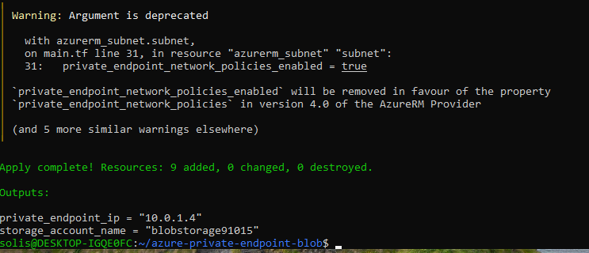
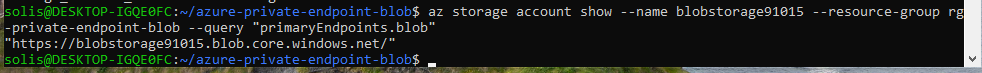

# Azure Private Endpoint for Blob Storage

## Project Overview
This project deploys a private endpoint for an Azure Blob Storage account. It prevents public internet access and secures communication through a private IP address within a virtual network.

### Purpose
- Establishes a private connection to Blob Storage using Azure Private Endpoint.
- Integrates with Azure Private DNS to resolve private IP addresses internally.
- Enhances security by avoiding public network exposure.

### Architecture
- Resource Group: rg-private-endpoint-blob
- Virtual Network: vnet-blob (10.0.0.0/16)
- Subnet: subnet-blob (10.0.1.0/24)
- Storage Account: blobstorage91015
- Private Endpoint IP: 10.0.1.4
- Private DNS Zone: privatelink.blob.core.windows.net

### Terraform Files
- main.tf - Infrastructure deployment configuration.
- variables.tf - Input variables for the configuration.
- outputs.tf - Outputs for key information.
- .gitignore - Files and folders to be ignored by Git.

### Deployment Steps
1. Initialize Terraform:
   ```bash
   terraform init
   ```

2. Apply the configuration:
   ```bash
   terraform apply -auto-approve
   ```

3. Verify the blob endpoint:
   ```bash
   az storage account show --name blobstorage91015 --resource-group rg-private-endpoint-blob --query "primaryEndpoints.blob"
   ```

### Screenshots
- Terraform Apply Success:  
  

- Blob Endpoint Query:  
  

### Interview Questions
1. What is a private endpoint in Azure?
2. How does private DNS integration work with Azure Private Endpoints?
3. Why would you choose a private endpoint over a service endpoint?
4. Can public access still reach the Storage Account with a Private Endpoint configured?
5. How do you troubleshoot if a private endpoint isn't resolving correctly inside a VM?

